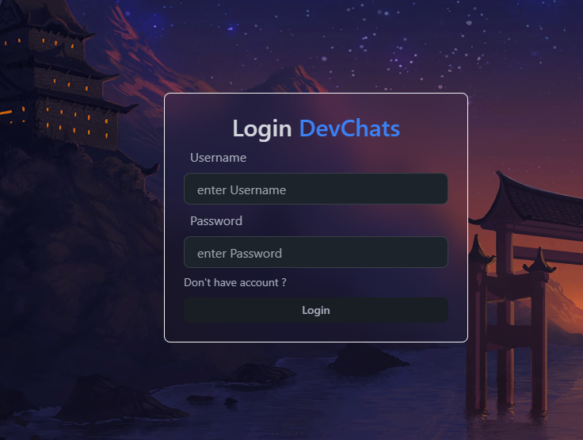
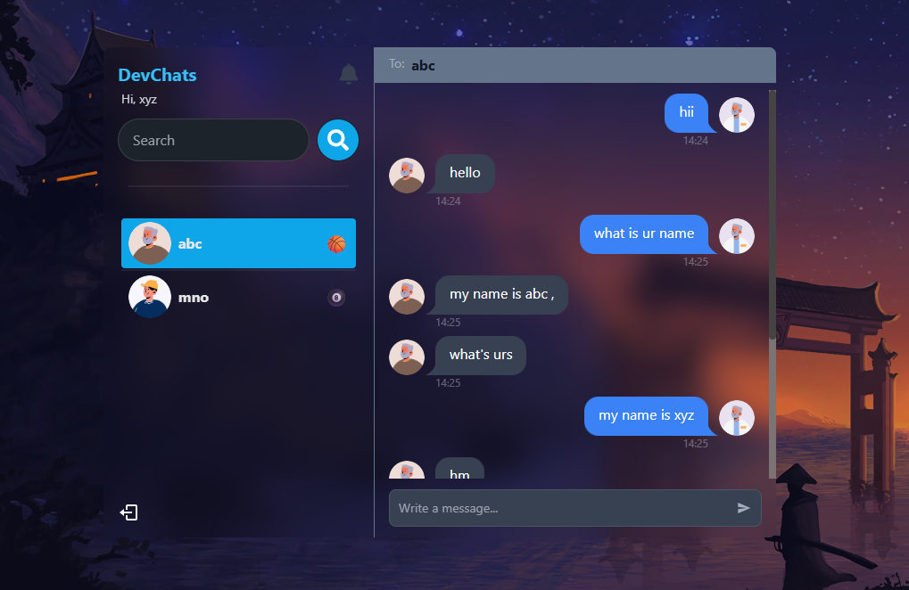

# 💬 DevChats - Real-time Chat Application

DevChats is a modern full-stack chat application that enables real-time messaging between users. Built with the MERN stack, it supports user authentication, online user tracking, unread message notifications, and socket-powered real-time communication.

---

## 🚀 Features

- 🔐 User Authentication (JWT-based)
- 🟢 Real-time messaging using Socket.IO
- 👀 Online user detection
- 🔔 Per-user unread message notifications
- ✅ Messages are stored in MongoDB for persistence
- 📱 Responsive and modern UI

---

## 🛠️ Tech Stack

### Frontend
- ⚛️ React.js + Vite
- 🎨 Tailwind CSS
- 📦 Context API

### Backend
- 🟢 Node.js
- 🚀 Express.js
- 🍃 MongoDB + Mongoose
- 🔌 Socket.IO

---

## 📸 Sample Screenshots

| Login Page | Chat Interface |
|------------|----------------|
|  |  |


---

## 🧪 Setup Instructions

### 🔧 Backend Setup

```bash
cd backend
npm install
